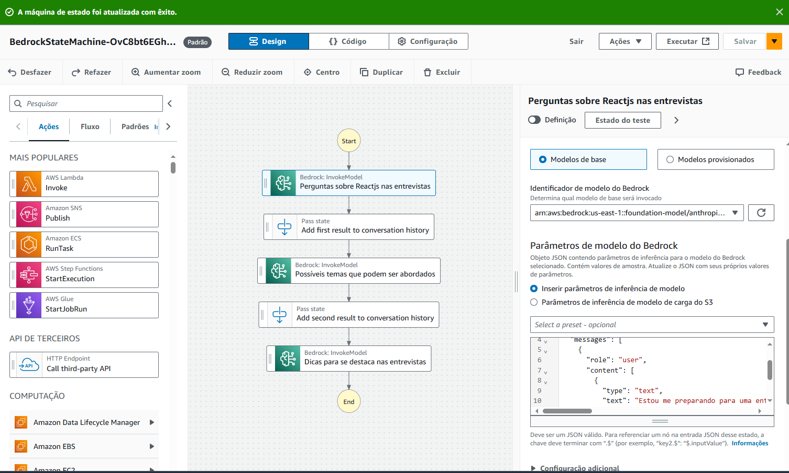

<h3 align="center">
Select the language for the documentation.

[<P style="text-align:center; display:inline-flex; justify-content: center; align-items: center; background-color: #fff; color: #000; border-radius: 5px; padding: 3px"> PT - BR</P>](readme.md)
[<P style="text-align:center; display:inline-flex; justify-content: center; align-items: center; background-color: #fff; color: #000; border-radius: 5px; padding: 3px"> ENG - US</P>](english.md)
</h3>

<hr />

<p align="center">


<h3 align="center">👣 Utilizando Step Function e Bedrock da AWS - Entrevista para Dev Frontend Reactjs</h3>
Este é um projeto desenvolvido com objetivo de usar o Step Function com o Bedrock da AWS para ajudar em entrevistas de emprego para desenvolvedores Frontend em Reactjs.
</p>

### Passos
- Possiveis perguntas sobre Reactjs
- Possíveis Temas
- Dicas para se destacar na entrevista

### Desenvolvimento
- Criação de Mudança de Estado
- Configuração de Politicas de Permissões
- Configuração de Modelos de Base - Modelo escolhido anthropic.claude-3-haiku
- Configuração de Token
- Configuração do Fluxo de Trabalho em Step Functions

<p>

</p>

### Código
```
{
  "Comment": "An example of using Bedrock to chain prompts and their responses together.",
  "StartAt": "Perguntas sobre Reactjs nas entrevistas",
  "States": {
    "Perguntas sobre Reactjs nas entrevistas": {
      "Type": "Task",
      "Resource": "arn:aws:states:::bedrock:invokeModel",
      "Parameters": {
        "ModelId": "arn:aws:bedrock:us-east-1::foundation-model/anthropic.claude-3-haiku-20240307-v1:0",
        "Body": {
          "anthropic_version": "bedrock-2023-05-31",
          "max_tokens": 2000,
          "messages": [
            {
              "role": "user",
              "content": [
                {
                  "type": "text",
                  "text": "Estou me preparando para uma entrevista de emprego para uma empresa gringa, como um desenvolvedor frontend Reactjs, me traz 10 perguntas possíveis que podem vir nessa entrevista a respeito da vaga de desenvolvedor Reactjs"
                }
              ]
            }
          ]
        },
        "ContentType": "application/json",
        "Accept": "*/*"
      },
      "Next": "Add first result to conversation history",
      "ResultPath": "$.result_one",
      "ResultSelector": {
        "result_one.$": "$.Body.content[0].text"
      }
    },
    "Add first result to conversation history": {
      "Type": "Pass",
      "Next": "Possíveis temas que podem ser abordados",
      "Parameters": {
        "convo_one.$": "States.Format('{}\n{}', $.prompt_one, $.result_one.result_one)"
      },
      "ResultPath": "$.convo_one"
    },
    "Possíveis temas que podem ser abordados": {
      "Type": "Task",
      "Resource": "arn:aws:states:::bedrock:invokeModel",
      "Parameters": {
        "ModelId": "arn:aws:bedrock:us-east-1::foundation-model/anthropic.claude-3-haiku-20240307-v1:0",
        "Body": {
          "anthropic_version": "bedrock-2023-05-31",
          "max_tokens": 2000,
          "messages": [
            {
              "role": "user",
              "content": [
                {
                  "type": "text",
                  "text": "Liste os temas dessa entrevista de emprego para desenvolvedor Reactjs na gringa"
                }
              ]
            }
          ]
        },
        "ContentType": "application/json",
        "Accept": "*/*"
      },
      "Next": "Add second result to conversation history",
      "ResultSelector": {
        "result_two.$": "$.Body.content[0].text"
      },
      "ResultPath": "$.result_two"
    },
    "Add second result to conversation history": {
      "Type": "Pass",
      "Next": "Dicas para se destaca nas entrevistas",
      "Parameters": {
        "convo_two.$": "States.Format('{}\n{}\n{}', $.convo_one.convo_one, $.prompt_two, $.result_two.result_two)"
      },
      "ResultPath": "$.convo_two"
    },
    "Dicas para se destaca nas entrevistas": {
      "Type": "Task",
      "Resource": "arn:aws:states:::bedrock:invokeModel",
      "Parameters": {
        "ModelId": "arn:aws:bedrock:us-east-1::foundation-model/anthropic.claude-3-haiku-20240307-v1:0",
        "Body": {
          "anthropic_version": "bedrock-2023-05-31",
          "max_tokens": 2000,
          "messages": [
            {
              "role": "user",
              "content": [
                {
                  "type": "text",
                  "text": "Quais dicas para se dar bem na entrevista e se destacar dos demais candidatos?"
                }
              ]
            }
          ]
        },
        "ContentType": "application/json",
        "Accept": "*/*"
      },
      "End": true,
      "ResultSelector": {
        "result_three.$": "$.Body.content[0].text"
      }
    }
  }
}
```